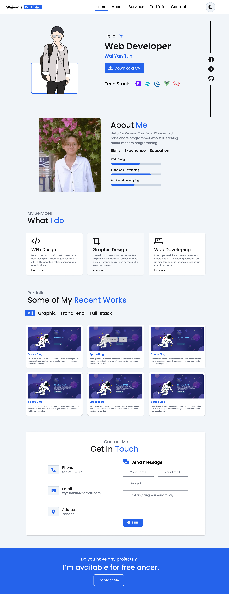
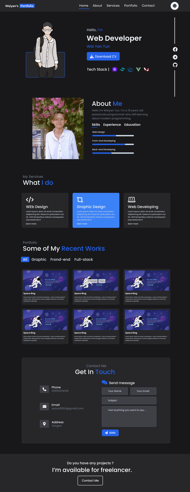

# Waiyan's portfolio

Deployment - [Demo](https://sayrgyiwoody.github.io/portfolio)

<h4>Languages</h4>
<ul>
    <li><b>HTML5</b> - HyperText Markup Language</li>
    <li><b>CSS3</b> - Cascading Style Sheets</li>
    <li><b>JavaScript ES6</b> - Scripting programming language</li>
</ul>

<h4>Frameworks and Libraries</h4>
<ul>
    <li>Tailwindcss</li>
    <li>Vue Js 3</li>
</ul>

<h4>WireFraming & Design</h4>
<ul>
    <li>Figma</li>
    <li>Fontawesome Icons</li>
    <li>icones.js.org</li>
</ul>

 You can also check <a href="https://www.figma.com/file/ecRGpPJ8tgfLD4vT5bK9nP/Portfolio-Remastered?type=design&node-id=0%3A1&mode=design&t=YPdotVk9RtEB1Zql-1">UI Design File Here</a>.

<h4>Management Source Code</h4>
<ul>
    <li>Git</li>
    <li>GitHub</li>
</ul>

